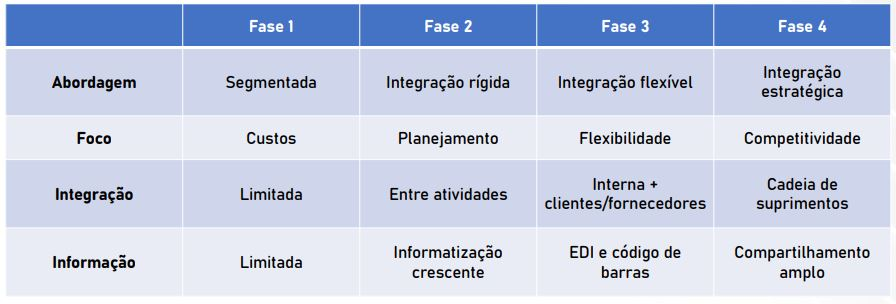

# EP101_-_LOGÍSTICA

Indrodução - Logística e Cadeia de suprimentos

- Por que a logística importa?

  - Produzir valor não é suficiente. É preciso disponibilizá-lo ao cliente
 
 Produto certo -> Lugar certo -> Momento certo -> Condição certa

- O que acontece com o valor de um produto quando ele não está disponível onde e quando o cliente precisa?

## Por que a logística importa?

A logística conecta oferta e demanda no espaço e no tempo

Comércio interno e externo
- Viabiliza a comercialização de bens e serviços entre diferentes localizações

Aproveitamento de oportunidades
- Permite combinar recuros, mão de obra, matérias-primas e mercados geograficamente dispersos

Credibilidade
- O desempenho logístico influencia o cumprimento de prazos e compromissos assumidos com o cliente

Criação de valor
- Contribui para gerar valor de tempo, lugar qualidade e informação

Quanto maior a separação entre fontes de recursos, produção e consumidores, maior a relevância de logística.

## Evolução da logística

## Crianção de Valor

- Valor de tempo
Bens e serviços devem estar disponíveis no momento em que são necessários

- Valor de lugar
Bens e serviços devem estar disponíveis no local adequado ao cliente

- Valor de qualidade
Os produtos devem chegar em condições adequadas de conservação e uso, sem avarias

- Valor de informação
O cliente deve ter acesso a informações sobre disponibilidade, pedido e entrega, preferencialmente de forma atualizada

## Objetivo da Logística e da Cadeia e Suprimentos

Objetivo: Atender às necessidades do cliente final de maneira eficiente.

Integração: Conhecer a atender às necessidades ds diferentes etapas da cadeia seja em termos de material como de informação.
